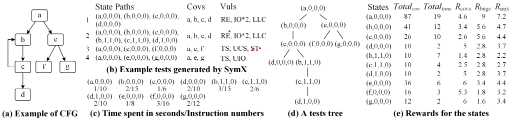
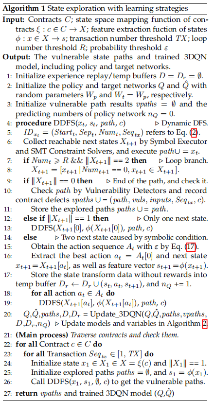
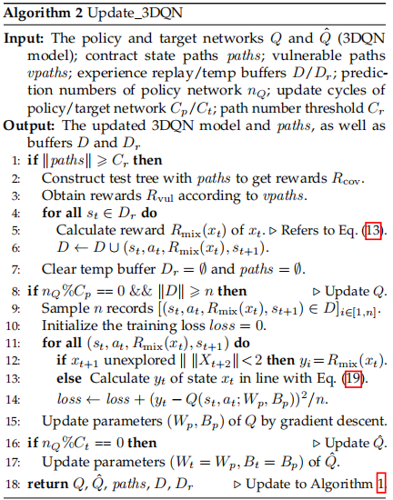
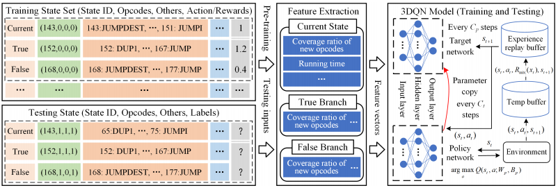

# Strategy Learning with Intelligent Agent

## Features

**Feature** | **Description** 
--- | --- 
covnumNew     | (1) Number of new instructions covered by the current state. (2) Number of new instructions covered by the true branch.\\(3) Number of new instructions covered by the false branch.  
covratioNew     | (1) Ratio of new instructions covered by the current state. (2) Ratio of new instructions covered by the true branch.\\(3) Ratio of new instructions covered by the false branch.  
covnum  | (1) Number of instructions covered by the current state.\\(2) Number of instructions covered by the true branch.\\(3) Number of instructions covered by the false branch.  
covratio | (1) Ratio of instructions covered by the current state.\\(2) Ratio of instructions covered by the true branch.\\(3) Ratio of instructions covered by the false branch.  
visitTimes  | (1) Visited times of this state in current transaction.\\(2) Visited times of state's true branch in current transaction.\\(3) Visited times of state's false branch in current transaction.  
constraint  | Size of the current state’s last constraints.  
stack | Size of the current state’s last call stack.  
time | Running time of all instructions covered by the current state.  
transeq | Transaction serial number of the state execution.  
depth | Number of states in current transaction along the path.  

The first step is to characterize the contract state $ x $ as a vector value $ s \in \mathbb{R}^{d} $ so that 3DQN can distinguish different states, \ie constructing state feature extraction function $ \phi $. The above table lists $ d $ unique features extracted for a symbolic state based on its information, such as ID, block instructions (i.e., opcodes), and execution depth. 
Specifically, the features consist of ten types. It is noted that the first five types requires the information of its true and false branches. The missing features can be filled with zeros for states with only one next state (ture branch) or no next states. 
(1) The *covnumNew* item refers to the number of new instructions achieved by the state and its branches, given that the states with more new coverage should be explored first. Thanks to the designs of ID, this item can be obtained by the number of instructions simply when $ Num_{State} == 0 $ , otherwise zero. 
(2) On this basis, the *covratioNew* item calculates the coverage ratio of new instructions to mitigate differences of varying contract sizes, due to more status instructions in the large contracts. Furthermore, in order to distinguish the repeated states, (3) the number of their instructions *covnum* and (4) the corresponding coverage ratio *covratio* are counted. 
(5) Meanwhile, the visited times of states *visitTimes* is used to identify repeated states, i.e., $ \mathit{Num}_{\mathit{State}} $ in their ID. 

The last five features are only calculated on the current states, since their values are the same as the branches, or they are captured from the execution progress while their branches are not explored. 
(6) The *constraint* item refers to the size of constraints at the end of the state, which can reflect the complexity of the current state path. (7) Similarly, the size of the last stack *stack* is calculated, as the larger the stack, the deeper the execution goes into. (8) The total execution time of instructions *time* is monitored to make the model perceive the execution efficiency, which is one of the goals of RSymX. (9) The transaction serial number \textit{transeq} (\ie $ \mathit{Seq}_{\mathit{Tx}} $ in ID) is recorded to specific the states in different execution, as most vulnerabilities rely on the execution of multiple transaction. Besides, inspired by the existing expert-designed heuristics [OSDI_KLEE, OOPSLA_symbolic], (10) the execution depth of state *depth* in current transaction is counted to further specify the state and enable model learn the advantages of those heuristics. 

In total, based on these features, 3DQN can describe states clearly. Given the decoupled implementation interface, more features can be supplemented to support large language models (LLMs) in the future. 

## Example of Rewards

## Model inference process

